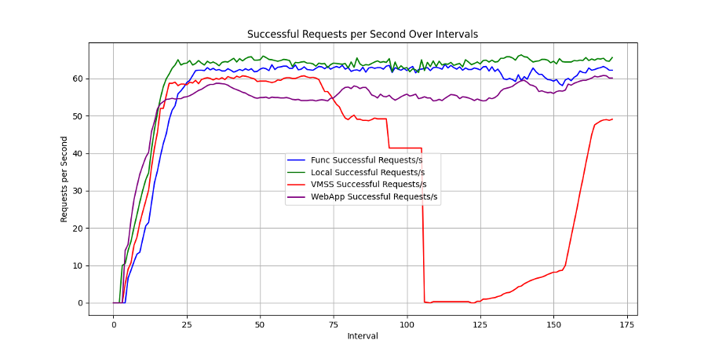

# Cloud Computing Azure Lab
These are a series of exercises I have tackled in the clouds computing course at EURECOM.
This lab assignment focuses on working with Microsoft Azure cloud services. The assignment is divided into five main parts:

### Creating a Microservice for Numerical Integration

1. Implement a program for numerical integration
- Convert the program into a microservice
- Test the microservice locally and perform load testing with Locust

2. Improving Availability with VM Scale Sets

- Create a VM scale set with 2 VMs
- Deploy the microservice on both VMs
- Perform load testing and observe load balancing
- Test failover by manually shutting down one VM

3. Scaling with Azure Web Apps

- Deploy the microservice on Azure Web Apps
- Configure auto-scaling
- Perform load testing and observe performance improvements

4. Scaling Microservice with Azure Functions

- Convert the numerical integration code into an Azure Function
- Configure auto-scaling for the function
- Perform load testing and observe function scaling

5. Implementing MapReduce using Azure Durable Functions

- Create a simple MapReduce framework using Azure Durable Functions
- Implement mapper, reducer, and shuffler functions
- Use Azure Blob Storage to store and retrieve input data
- Deploy and test the entire solution on Azure

Run Locust for 3 minutes each on (i) locally deployed numericalintegral, (ii) VM scaleset with 2 VMs where you shutdown the VM running the workload after 1 minute, (iii) autoscale webapp initially configured with 1 instance and max 3, (iv) autoscale function. Save locust output. Plot a graph of number of successful requests/seconds with one line for each of the four cases above. Paste the graph below.

We Ran Locust for 3 minutes each on (i) locally deployed numericalintegral, (ii) VM scaleset with 2 VMs where we shutdown the VM running the workload after 1 minute, (iii) autoscale webapp initially configured with 1 instance and max 3, (iv) autoscale function. This is a graph of number of successful requests/seconds with one line for each of the four cases above.